<h3> Procedure</h3>

The Master File Table (MFT) is a crucial component of the NTFS (New Technology File System) used by Windows. It serves as a database that stores detailed metadata about every file and directory on an NTFS volume, including file names, sizes, permissions, and timestamps. Each file or directory is assigned a unique entry in the MFT, which contains both system and user data. The MFT allows the NTFS file system to quickly locate and manage files. It is essential for file operations, including creating, reading, and writing files.

<h4> Steps</h4>

1. **To initiate the simulation, click the Outlook button to open the Outlook interface on the computer.**

   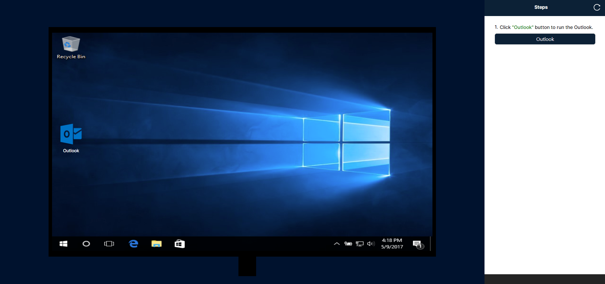

2. **Select the email from Outlook to view its details on the right side, where the attached Word file will be listed under the name "application."**

   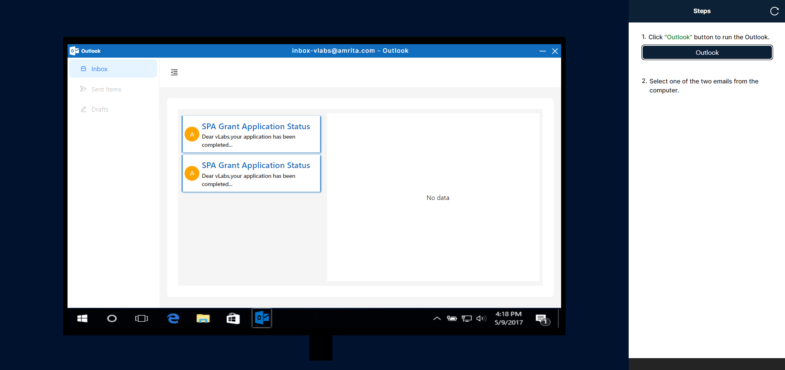

3. **Click the download icon to save the application.doc file, then close Outlook.**

   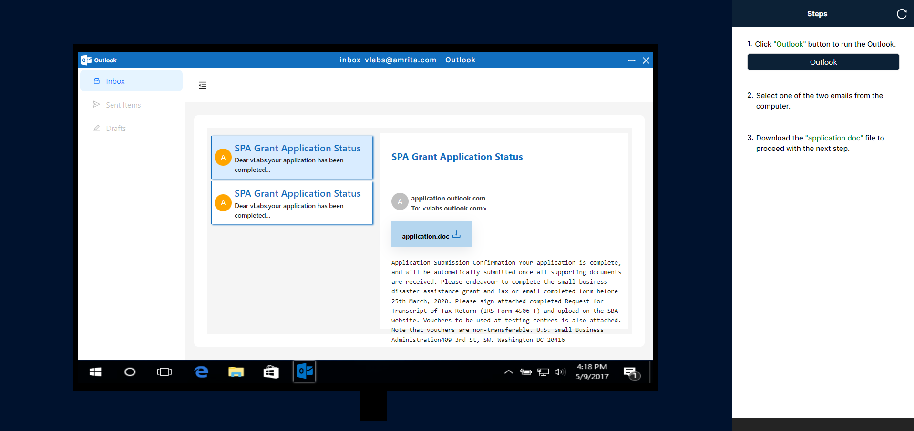

4. **Clicking the "application.doc" button will open the Word document on your computer. Once Word is opened, the "Powershwll" application will be triggered and opened automatically.**

   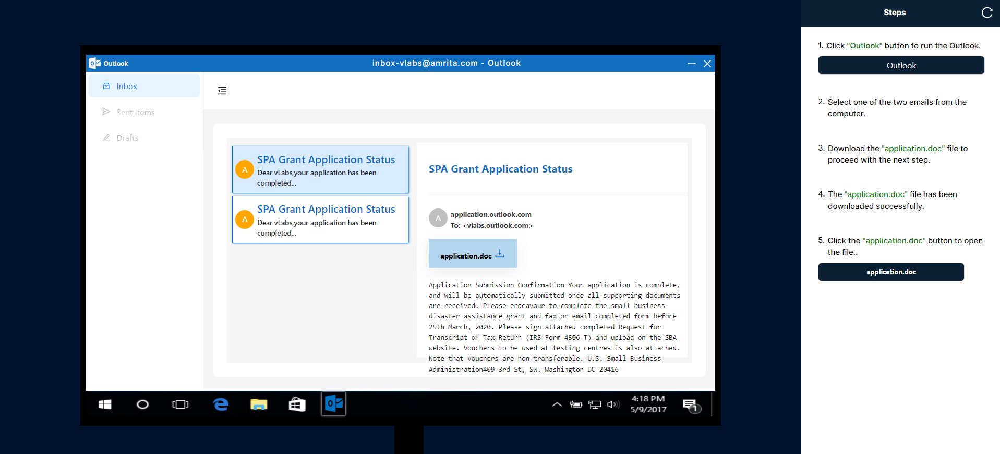

5. **Upon opening PowerShell, the VBScript will execute automatically, creating a desktop.ini file. To proceed with the next command, select "Execute." To view the location of the desktop.ini file in the Master File Table (MFT), choose "Show MFT."**

   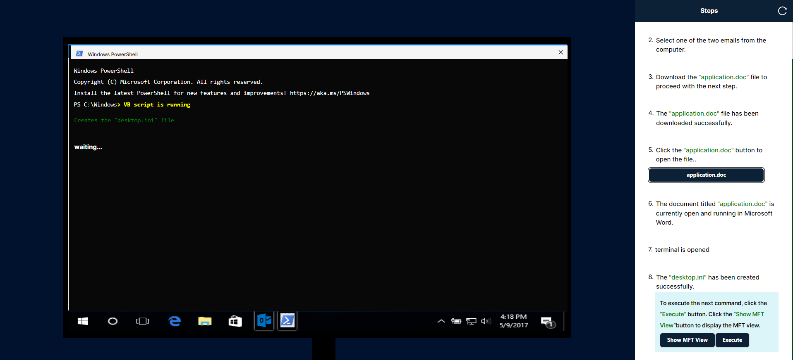

6. **After clicking the Execute button, the system will execute the subsequent command, which writes the text "hjfkhdfbdbfkdfkd" to the file located at desktop.ini.**

   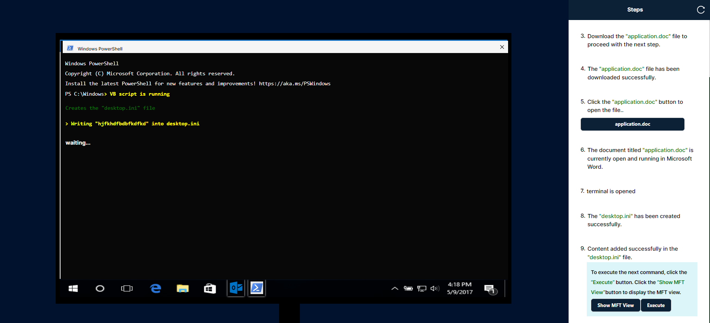

7. **After clicking the execute button, the system will download the shellcode from a URL using wget and append the shellcode to the Alternate Data Stream (ADS) of the desktop.ini file.**

   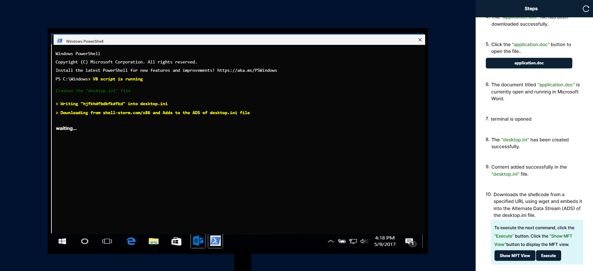

8. **After clicking the execute button, the subsequent command will delete the previously created desktop.ini file.**

   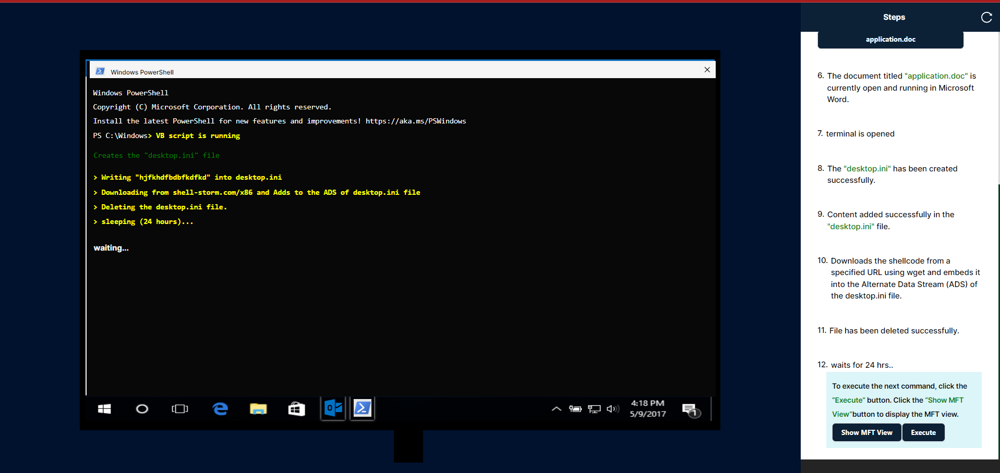

9. **After clicking the execute button, will wait 24 hours and click execute button to extract the mft ,offset from the content.**

   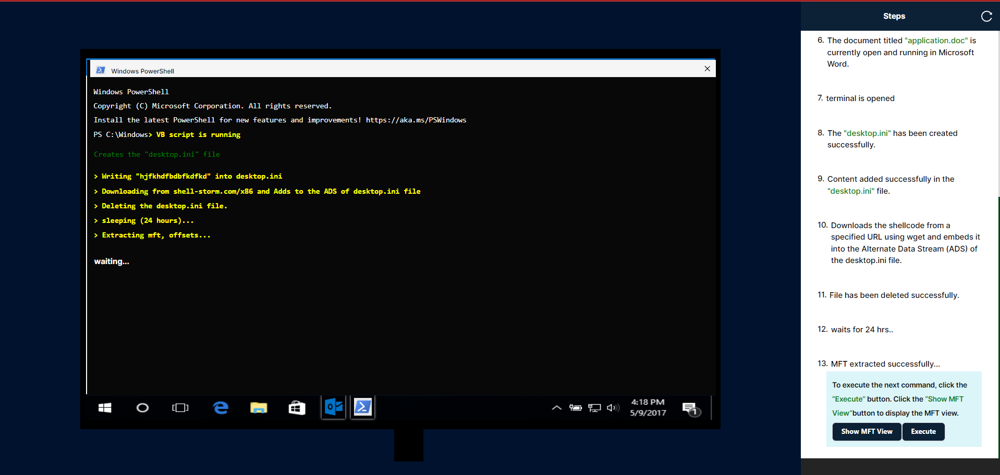

10. **After clicking the execute button, Extracts the shellcode.**

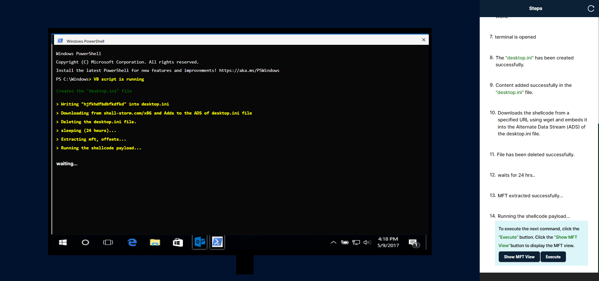

11. **After clicking the execute button, execute the shellcode.**

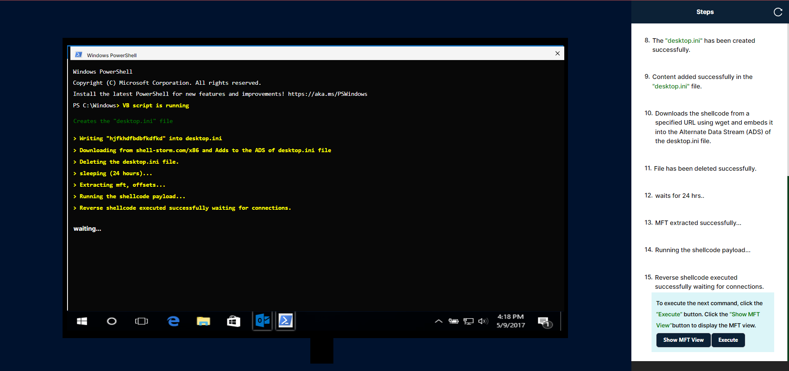

12. **After the execute button is clicked, the hacker will be logged in, and the system will automatically initiate self-destruction.**

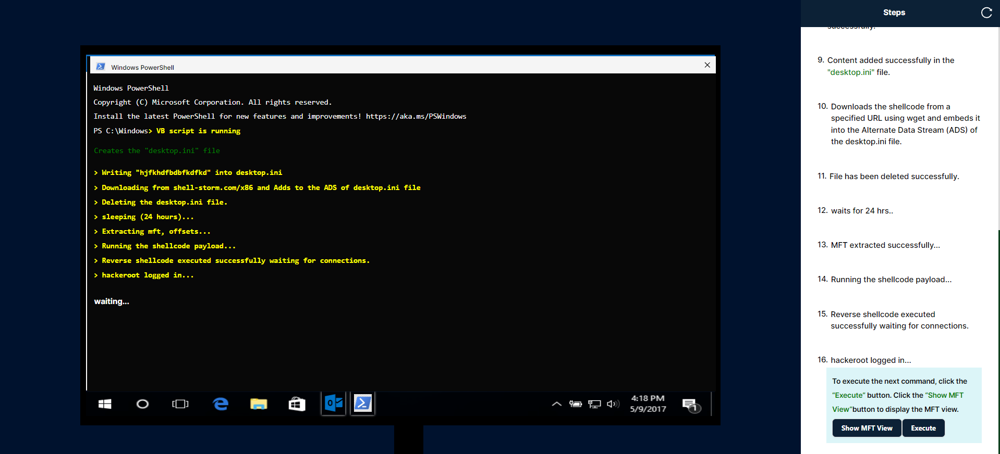
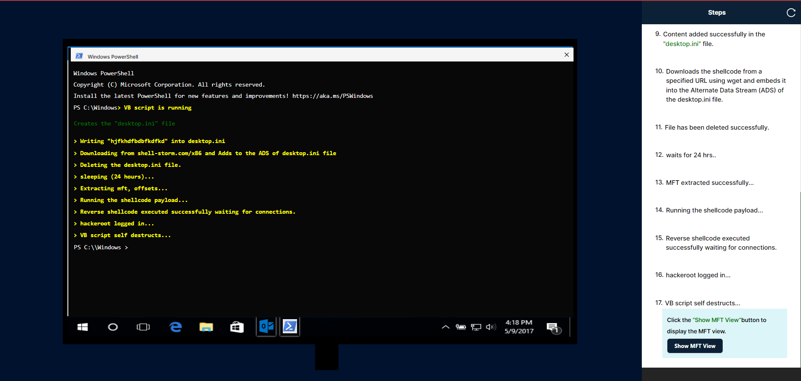

<h4> Steps</h4>

**Master File Table**

1. **Clicking the "Show MFT View" button will display the MFT Table view on the left side, with corresponding instructions on the right side. The instruction panel will include a "Go to Simulation" button, which will navigate to the real-time simulation currently being conducted with Outlook.**

   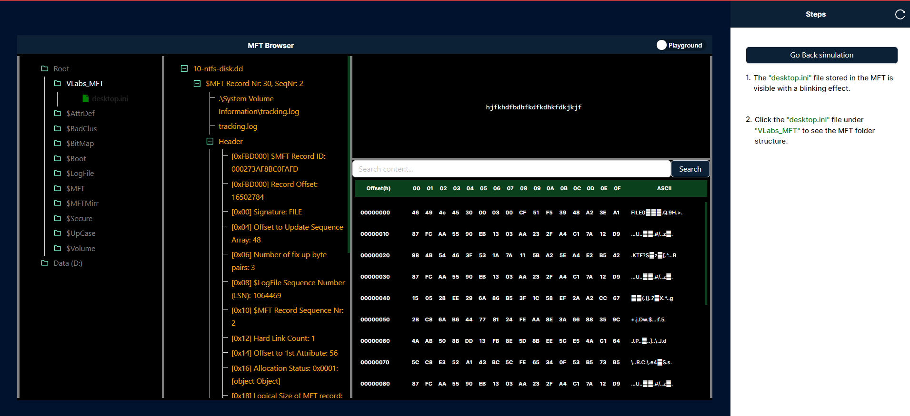`

2. **The switch icon in the MFT browser facilitates toggling between the file explorer view and the hex offset view.**

   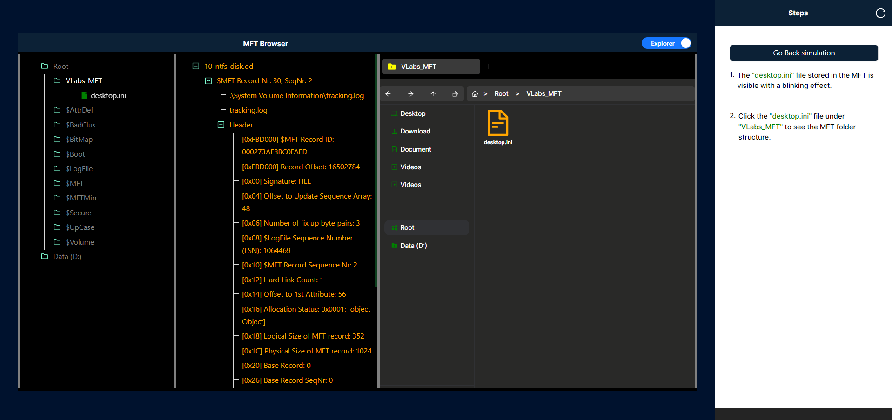

3.**Whenever a file is created in the simulation, it will be reflected in both the MFT browser and the file explorer. You can view these changes by clicking the "Show MFT View" button in the simulation.**

   

4. **In the offset panel, you can search for the content "hjfkhdfbdbfkdfkd" using the search input, and then click the search button to locate the offset and highlight the hexadecimal value in red.**

   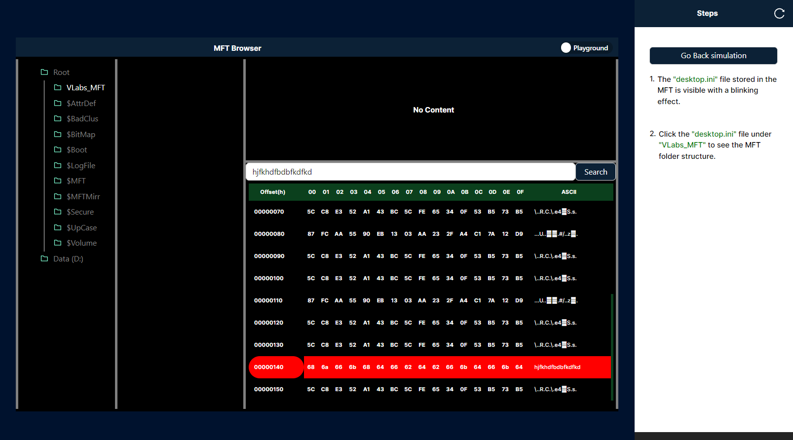
